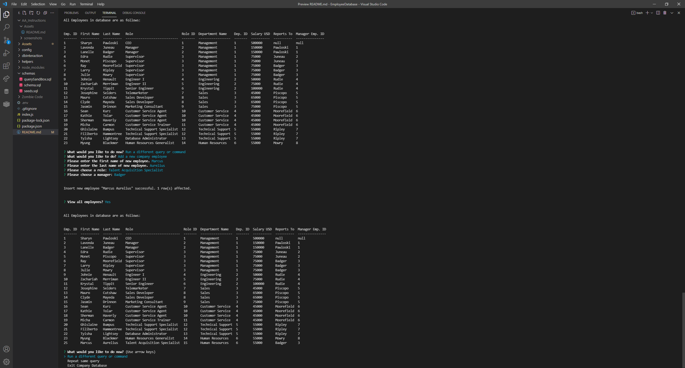

# Employee Database [")](https://opensource.org/licenses/MIT)
  
  ## Description
  This application was written as a CLI for non-tech users to interact with a database. It provides full CRUD functionality in an intuitive way that does not require a single command to be known. 
  
  This was an excellent exercise in writing Structured Query Language (SQL) and interfacing a MySql database with NodeJS via the standard MySql2 module.
  
  It was also an excellent exercise in understanding asynchronous code in Node.js utilizing both promise and Async/Await syntax, as well as in writing my own libraries of functions and modularizing them for better abstraction, separation of concerns, and achievement of goals in the project.

### Technologies Used:
* MySql 2
* Inquirer
* MySql Workbench
* NodeJS
* Console.table package

_**View the official Employee Database Walkthrough Video by clicking [HERE](https://www.youtube.com/watch?v=mr9s2TDTW-8) or by pasting the following link in your browser: https://www.youtube.com/watch?v=mr9s2TDTW-8**_
  


  ---
  ## Table of Contents
  1. [Installation](#installation)
  1. [Usage](#usage)
  1. [Contribution](#contribution)
  1. [License](#license)
  1. [Questions](#questions)

  ---
  
  ## Installation
    
To install this application, follow the below steps:


1. download the entire directory to a place on your computer in which it can be found.
2. Navigate to the application directory in your terminal.
3. Install dependencies with the following command:

```bash
npm install
```

4. Run the all queries in schema.sql in the order they appear.
5. Run the all queries in seeds.sql in the order they appear.
6. You may now initialize and access the database from the terminal in the application directory with the following command:

```bash
node index.js
```

This will take you to the main menu for accessing the database. 

---

## Usage
    
Employee Database has a variety of commands to provide for full CRUD (Create, read, update, delete) functionality while interacting with the database. While initializing the application required knowledge of navigating the terminal and running scripts via node, the application itself does not require any knowledge or understanding of BASH commands to directly use.

The database architecture utilizes three tables: 

* Department
* Role
* Employee

Each table tracks its respective data. Each table has an auto_increment id attribute as the primary key. 

The master table is Department. The Role table tracks the Department table via each roles "department_id" foreign key. 
The employee table tracks the role table via each employee's "role_id" foreign key. 

The app is initialized after install by navigating to the project directory in the terminal on your machine (location varies) and entering the following command:

```bash
node index.js
```

From here, you will be taken to the command selection screen, with available options for interacting with the database:


Navigation is accomplished via the **up** and **down** arrow keys, and a selection is made by pressing **spacebar**.

The commands are divided into four categories, demarcated by dotted lines in the selection prompt:

1. View 
2. Add
3. Update
4. Delete

For convenience, there is also an **Exit Company Database** command, that will relinquish the applications control of the terminal and close the database connection.

Please note, that the database can be entirely reset to default (additional data will be lost!) by running sequentially the schema and then the seeds.

### View
These selections will return their corresponding data for view by the user. They will *not* mutate the database. They include:

* **View all company departments** - Returns a list of all current departments and their ID's.
* **View all company roles** - Returns a list of all roles in all departments and their ID's
* **View all company employees** - Returns a complete list of all employees and their information, across all roles and departments.
* **View employees under a specific manager** - Prompts to select an individual from the management department and returns a list of their direct reports.
* **View employees in a specific department** - Prompts to select a department and returns a list of all employees in that department.
* **View all department salary budgets** - Returns a list of all departments, and the aggregate sum of each employee in that department. 

### Add
These selections allow a user to add additional data to the database. They *will* mutate the database. They include:

* **Add a new company department** - Prompts for the name of the department.
* **Add a new company role** - Prompts for the name of the role and to select its department.
* **Add a new company employee** - Prompts for employee first name, last name, and to select their role. Department is assigned according to role.

### Update
These selections allow a user to change existing data in the database. They *will* mutate the database. They include:

* **Update an employee's role** - Shows list of employees and prompts to enter the employees ID, then select their new role.
* **Update an employee's manager** - Shows list of employees and prompts to enter the employees ID,then select their new manager.

### Delete
These selections allow a user to delete existing data from the database. They *will* mutate the database, and carry the biggest potential for error as their deletion effects will cascade. For example, deleting a department will also delete all of it's roles and employees. Deleting a role, will also delete all employees in that role. For this reason, each of these prompts does have a confirmation option before proceeding to prevent accidental loss of data.

* **Delete a company department** - Prompts to select the department, then confirms to be sure.
* **Delete a company role** - Prompts to select the role, then confirms to be sure. 
* **Delete a company employee** - Shows list of employees and prompts to enter the employee's ID. Confirms to be sure.

---

## Contribution
    
Thank you for considering contributing to this project. If you would like to contribute, feel free to fork the repository, add your functionality or bugfix, and submit a pull request. I will review the changes and contact you with any questions or concerns.

Please refer to the code for consistent and descriptive variable naming and utilize proper indentation and syntax for readability.

Please see the [Questions](#questions) section if you would like to reach me directly to discuss possible directions for the project or ideas for improvement.

---

## License
  
  This application is licensed under **The Massachusets Institute of Technology License (MIT)**.
  
  Click the license badge below for more information and usage guidelines:
  
  [")](https://opensource.org/licenses/MIT)
  
  Click [here](https://www.mit.edu/~amini/LICENSE.md
  "MIT Full Terms and Conditions") to view the full terms and conditions text of MIT.
  
  ---
  
  ## Questions
  
Please do not hesitate to reach out with any questions you may have. I can be reached in the following ways:

* Email: [ElijahARomer@gmail.com](mailto:ElijahARomer@gmail.com)
* GitHub: [ElijahRomer](http://www.github.com/ElijahRomer)


Thank you for reaching out and I look forward to getting in touch with you soon!


